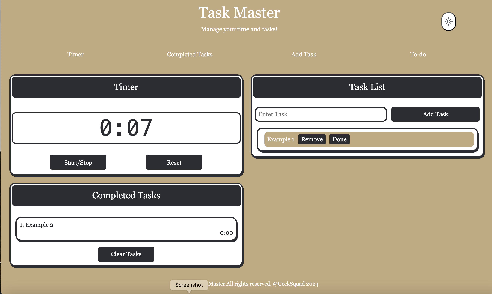
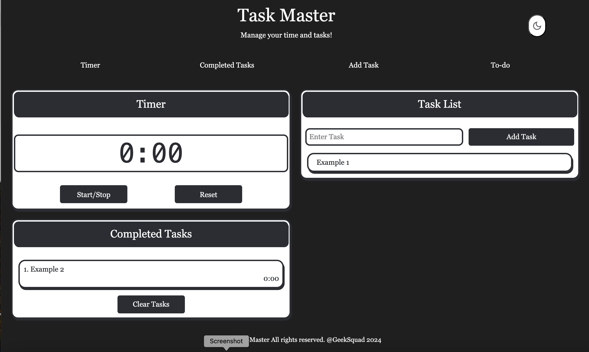
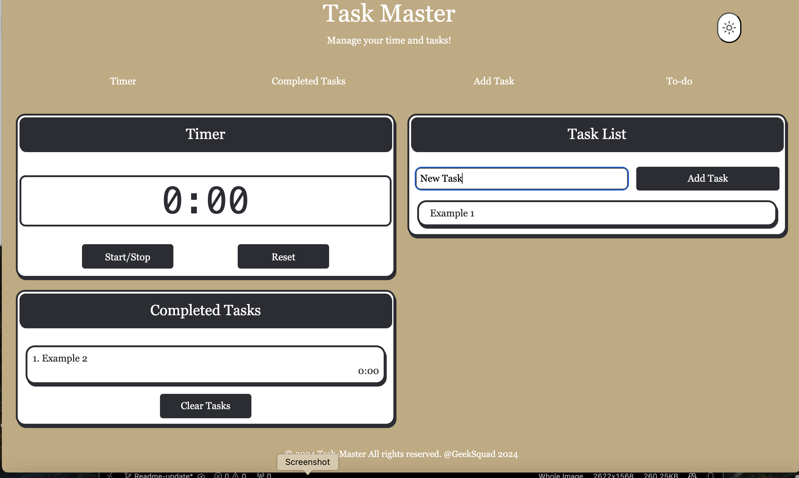

# Task Manager

## Table of Contents

- [Overview](#Overview)
- [User Story](#User_Story)
- [Acceptance Criteria](#Acceptance-Criteria)
- [Features](#Features)
- [Deployment](#Deployment)
- [Usage](#usage)
- [Contributing](#contributing)
- [License](#license)

# Task Management App

## Overview

The Task Management App is designed to help PC users efficiently coordinate and manage their tasks throughout the workday. This app not only allows users to seamlessly move from task to task but also enables them to record the time spent on each individual task, providing valuable insights into their time management.

## User_Story

**As a PC user, I want a task management app where I have the ability to coordinate and manage my tasks throughout my work day and reflect on my own time management. I want to be able to record the time spent on each individual task and seamlessly move from task to task.**

### Acceptance Criteria:

- The user can create and delete tasks.
- The user can start and stop a timer to record the actual time spent on each task.
- The user can easily transition between tasks with minimal interruption.
- The user can view a history of completed tasks and the time spent on each.
- The app is intuitive and easy to navigate, with a focus on productivity and time management.

## Features

- **Task Creation and Management**: Easily create and delete tasks.
- **Time Tracking**: Start and stop timers for each task to record the time spent.
- **Seamless Task Transition**: Move smoothly from one task to another without disrupting workflow.
- **Time Management Insights**: Review time spent on tasks to identify areas for improvement.
- **User-Friendly Interface**: Simple and intuitive design focused on enhancing productivity.

  ". 

  

  

## Deployment

You can access the deployed version of the Task Management App at the following link:

[Task Management App Deployment](https://juangirelli.github.io/Task-Manager/ )

## Usage

- Open the app and create your tasks for the day.
- Assign estimated time durations to each task.
- Start the timer when you begin a task, and stop it when you’re done.
- Transition smoothly to your next task by selecting it from your task list.
- At the end of the day, review the time spent on each task and reflect on your productivity.

## Contributing

Contributions are not welcome.

## License

This project is licensed under the MIT License. See the `LICENSE` file for more details.

## Contact
For questions or suggestions, feel free to reach out to Juan Girelli at [Juangirelli@gmail.com].
